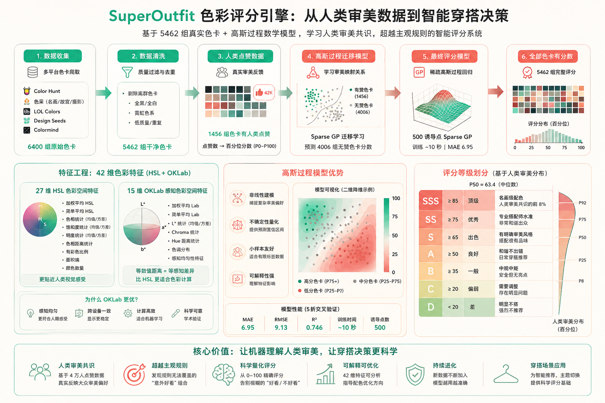

<p align="center">
  
</p>

<h1 align="center">SuperOutfit</h1>

<p align="center">
  <strong>AI 智能穿搭顾问</strong> — 基于 5462 组真实色卡 + 高斯过程数学模型的穿搭推荐系统
</p>

<p align="center">
  
  
  
</p>

<p align="center">
  一行命令安装，一键启动服务<br>
  不需要手动配置环境，不需要了解 Python
</p>

<p align="center">
  <em>支持 MCP Server · CLI 命令行 · FastAPI 后端 · Vue 前端</em>
</p>

---

## ⚡ 一键安装

### Windows (PowerShell)

```powershell
irm https://raw.githubusercontent.com/egg-rolls/SuperOutfit/master/scripts/install-simple.ps1 | iex
```

### macOS / Linux (Bash)

```bash
curl -fsSL https://raw.githubusercontent.com/egg-rolls/SuperOutfit/master/scripts/install.sh | bash
```

安装完成后，打开新终端，直接使用：

```bash
spof --help            # 查看所有命令
spof gateway    # 启动服务（API + 前端 + MCP）
```

> 📖 详细安装说明见 [docs/INSTALL.md](docs/INSTALL.md)

---

## ✨ 核心能力

### 🎨 色彩评分引擎

基于 **5462 组真实人类审美色卡**训练的高斯过程模型，不是拍脑袋的规则，是人类用点赞投票出来的审美共识。

<p align="center">
  
</p>

```
评分等级（基于人类审美分布 P50=63.4）：

  SSS ≥ 85   顶级     名画级配色，人类审美共识的前 8%
  SS  ≥ 75   优秀     专业搭配师水准
  S   ≥ 65   出色     有明确审美风格
  A   ≥ 50   良好     和谐不出错
  B   ≥ 35   一般     中规中矩
  C   ≥ 20   偏弱     需要调整
  D   < 20   差       明显不搭
```

**数据来源：** Color Hunt + 色采（名画/故宫/摄影配色）+ LOL Colors + Design Seeds + Colormind

**技术栈：** 42 维特征（HSL + OKLab）→ 点赞迁移 → 稀疏高斯过程（500 诱导点）

### 🎨 主题系统

从色卡中提取 4 色切换全站主题，自动派生 20+ CSS 变量，确保文字对比度始终可读。

- 点击色卡直接应用主题（4 色直接应用，>4 色弹窗选择）
- 派生深色系、浅色系、文字色、交互色
- 文字色根据背景亮度动态计算（WCAG ≥ 4.5:1）

### 🧥 衣橱管理

每件衣物一个 YAML 文件 + 一张图片。你可以：
- 在资源管理器里直接浏览、编辑、拖拽图片
- 用 AI 语音/文字添加衣物（支持图片识别）
- 按类型/风格/季节/场合筛选
- 自动统计穿着频率
- **Web 界面编辑** — 点击卡片直接打开编辑弹窗

### 📊 穿着追踪

记录每次穿着、清洗，自动统计穿着频率和清洗周期：
- `spof wear add` — 记录今天穿了什么
- `spof wear wash` — 记录清洗
- `spof wear check` — 查看哪些衣物该洗了
- `spof wear report` — 穿着频率统计报告

### 🛒 购物清单

同一套 CRUD 命令，加 `--wishlist` 标志即可管理购物清单：
- `spof add --wishlist` — 添加心愿单品
- `spof list --wishlist` — 查看购物清单
- 数据独立存储在 `data/wishlist/` 目录

---

## 🚀 快速开始

### 方式 1：Gateway 一键启动（推荐）

```bash
# 启动所有服务（API + 前端 + MCP）
spof gateway

# 浏览器打开 http://localhost:32200
```

Gateway 会自动：
- 启动 FastAPI 后端（端口 32201）
- 启动 Vue 前端（端口 32200）
- 启动 MCP Server（stdio）
- 自动查找空闲端口
- 监控服务状态

### 方式 2：CLI 命令行

```bash
# 查看帮助
spof --help

# 添加衣物
spof add --type "上衣" --sub-type "T恤" --primary-color "黑色"

# 查看衣橱
spof list

# 色彩评分
spof color score --colors "#F5F0E8,#C4A97D,#111111"

# 天气查询
spof weather --city "大连"

# 记录穿着
spof wear add --items item_001,item_003 --occasion "通勤"
```

### 方式 3：Web 界面

```bash
# 启动后端（不含 MCP）
spof gateway --no-mcp

# 浏览器打开 http://localhost:32200
```

### 方式 4：MCP Server

```bash
# 启动 MCP Server（不含前端）
spof gateway --no-frontend

# 在 AI Agent 中配置 MCP Server 路径
# 然后对 AI 说：\"帮我推荐今天的穿搭\"
```

---

## 🛠️ 命令速查

v3.2 采用 **6 大命令模块** 设计，所有功能通过 `spof` 统一入口调用：

```bash
# === 衣橱 / 购物清单 CRUD ===
spof add --type "上衣" --sub-type "T恤" --primary-color "黑色"
spof add --wishlist --name "白色帆布鞋" --budget 500
spof list [--json] [--category "上衣"] [--style "通勤"]
spof list --wishlist
spof show item_001
spof edit item_001 --wear-count 5
spof delete item_001

# === 穿着追踪 ===
spof wear add --items item_001,item_003 --occasion "通勤"
spof wear wash --items item_001
spof wear check                        # 查看哪些衣物该洗了
spof wear report                       # 穿着频率统计

# === 色彩工具 ===
spof color score --colors "#F5F0E8,#C4A97D,#111111"
spof color inverse --known "#F5F0E8,#111111" --target 75 --missing 2

# === 天气查询 ===
spof weather                           # 从配置读取城市
spof weather --city "大连"

# === 数据管理 ===
spof data export                       # 导出数据
spof data import                       # 导入数据

# === 系统管理 ===
spof info                       # 查看系统信息
spof gateway up                 # 启动服务
spof gateway down               # 停止服务
spof gateway status             # 查看服务状态

# === 应用更新 ===
spof update                            # git pull 更新
```

> 📖 完整命令参考见 [CLI.md](CLI.md)

---

## 🎨 色彩评分技术

### 为什么比"规则"更准

```
传统方案：专家写的规则 → 同色系 95 分，撞色 55 分
  问题：规则有主观偏见，无法覆盖"意外好看"的组合

SuperOutfit：5462 组人类点赞色卡 → 学习人类审美共识
  优势：被 4 万人的点赞验证过，包含规则无法覆盖的配色
```

### 数据管道

```
6400 原始色卡
  → 剔除离群（全黑/全白/霓虹色 938 组）
  → 5462 干净色卡
  → 1456 组有人类点赞 → 百分位分数
  → Sparse GP 迁移模型 → 预测 4006 组无赞色卡
  → 5462 组全部有分数
  → Sparse GP 最终模型（500 诱导点，MAE 6.95，训练 ~10 秒）
```

### 42 维特征

```
27 维 HSL 色彩空间：
  加权平均 HSL / 简单平均 HSL / 色相统计 / 饱和度统计
  明度统计 / 色相距离统计 / 有彩色比例 / 面积熵 / 颜色数量

15 维 OKLab 感知色彩空间：
  加权平均 Lab / 简单平均 Lab / L 统计
  Chroma 统计 / Hue 距离
  （等数值距离 = 等感知差异，比 HSL 更适合色彩计算）
```

---

## 🎨 主题系统技术

### 设计原则

1. **4 个基础色** — accent（强调）、canvas（背景）、dark（深色）、muted（辅助）
2. **全部派生** — 从 4 色自动计算 20+ CSS 变量
3. **对比度保护** — 文字色根据背景亮度自动计算（WCAG ≥ 4.5:1）
4. **色卡切换** — 点击色卡直接应用主题

### CSS 变量层级

```
用户可配置（4 个）:
  --user-accent    → 按钮、强调色
  --canvas         → 页面背景
  --dark           → 深色表面
  --user-muted     → 辅助文字

派生自 dark:
  --surface-dark-elevated    → 深色提升面
  --surface-dark-soft        → 深色软面

派生自 canvas:
  --surface-soft             → 浅色软面
  --surface-card             → 卡片背景
  --surface-cream-strong     → 强调浅色
  --hairline                 → 边框线
  --hairline-soft            → 软边框

派生自文字色（基于 canvas 对比度）:
  --ink                      → 主文字
  --body                     → 正文
  --body-strong              → 强调正文
  --muted-soft               → 柔和辅助

派生自 accent:
  --primary-active           → 按钮按下
  --primary-disabled         → 禁用按钮

特殊文字（基于各自背景对比度）:
  --on-primary               → accent 上的文字
  --on-dark                  → dark 上的文字
  --on-dark-soft             → dark-soft 上的文字
```

### 实现文件

| 文件 | 职责 |
|------|------|
| `frontend/src/App.vue` | `applyTheme()` 函数，设置所有 CSS 变量 |
| `frontend/src/views/PalettesView.vue` | `generateTheme()` 函数，计算派生颜色 |

---

## 📦 分享给别人

```bash
# 导出 zip（不含个人数据）
uv run python scripts/export.py

# 或直接发 Git 仓库链接
# .gitignore 已排除所有个人数据
```

接收者：`git clone` → `uv sync` → 开始使用。

---

## 🤖 AI 集成

### MCP Server（推荐）

```bash
# 启动 MCP Server
spof gateway --no-frontend

# 在 AI Agent 中配置 MCP Server 路径
# 然后对 AI 说：\"帮我推荐今天的穿搭\"
```

支持的 AI Agent：
- Claude Code
- Cursor
- OpenCode
- 任何支持 MCP 协议的 AI

### Hermes Agent

```bash
cp -r . ~/.hermes/skills/productivity/superoutfit
hermes curator pin superoutfit
# 对 Hermes 说：\"帮我推荐今天的穿搭\"
```

### CLI 直接调用

```bash
# AI 可以直接调用 CLI 命令
spof color score --colors "#F5F0E8,#C4A97D,#111111"
spof list --json
spof wear report
```

### Python 直接调用

```python
from scripts.scorer import score_outfit

result = score_outfit(["item_001", "item_003", "item_006"], occasion="通勤", temp=22)
print(result["total_score"], result["grade"])
# 63.7 B
```

---

## 🏗️ 项目架构

```
┌─────────────────────────────────────────────────────────────┐
│                     SuperOutfit Gateway                      │
├─────────────────────────────────────────────────────────────┤
│                                                             │
│  ┌──────────────┐  ┌──────────────┐  ┌──────────────┐      │
│  │   FastAPI     │  │   Vue 前端   │  │  MCP Server  │      │
│  │   (API)       │  │   (Web UI)   │  │  (AI 工具)   │      │
│  │   :32201      │  │   :32200     │  │   stdio      │      │
│  └──────────────┘  └──────────────┘  └──────────────┘      │
│         │                 │                 │                │
│         └─────────────────┼─────────────────┘                │
│                           │                                  │
│                    ┌──────┴──────┐                          │
│                    │   scripts/  │                          │
│                    │   (共享)    │                          │
│                    └─────────────┘                          │
│                                                             │
└─────────────────────────────────────────────────────────────┘
```

### 技术栈

- **后端**: Python 3.11 + FastAPI + uvicorn
- **前端**: Vue 3 + Vite + Naive UI + @vicons/ionicons5
- **数据**: YAML 文件存储，用户可直接编辑
- **AI**: 高斯过程模型（scikit-learn）+ 42 维特征（HSL + OKLab）
- **依赖管理**: uv（Python）+ npm（Node.js）
- **设计系统**: Claude 风格（暖色调画布、珊瑚色强调、衬线标题）

### Git 提交规范

```bash
<type>(<scope>): <subject>
```

- `feat`: 新功能
- `fix`: Bug 修复
- `refactor`: 重构（不改变功能）
- `ui`: UI/样式调整
- `data`: 色卡数据更新
- `model`: 模型重训/升级
- `docs`: 文档更新
- `chore`: 杂项（.gitignore 等）

---

## 📄 License

MIT © egg-rolls
